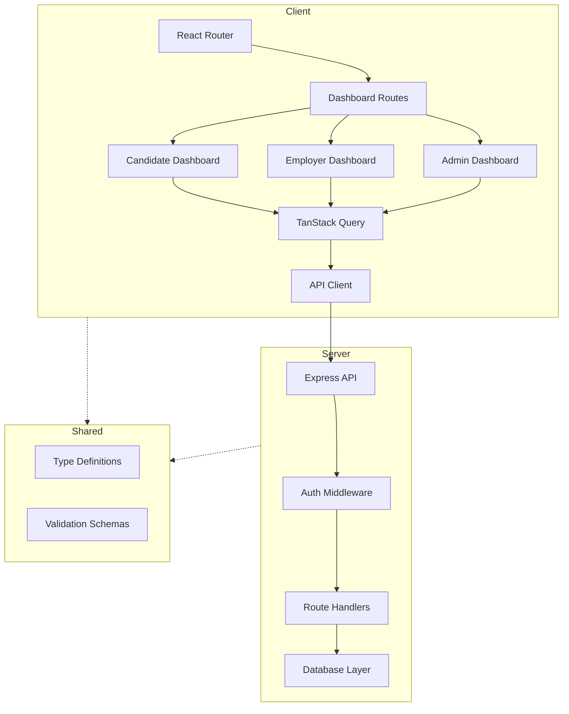

# Design Document

## Overview

This design document outlines the architecture and implementation approach for the InfyJobs user dashboards feature. The system will provide three distinct dashboard experiences tailored to Candidates, Employers, and Super Admins, each with role-specific functionality and data management.

The implementation will leverage the existing React + TypeScript + Vite stack with TanStack Query for data fetching, React Router for navigation, and shadcn/ui components for consistent UI patterns. The backend will use Express with RESTful API endpoints for data operations.

### Key Design Principles

1. **Role-Based Access Control**: Each user type has distinct routes, components, and API endpoints
2. **Shared Component Architecture**: Reusable UI components across all dashboard types
3. **Responsive Design**: Mobile-first approach with adaptive layouts
4. **Real-time Updates**: Optimistic UI updates with TanStack Query for smooth UX
5. **Type Safety**: Full TypeScript coverage for API contracts and component props

## Architecture

### High-Level Architecture



### Directory Structure

```
client/
├── pages/
│   ├── candidate/
│   │   ├── Dashboard.tsx
│   │   ├── Profile.tsx
│   │   ├── AppliedJobs.tsx
│   │   └── FavouriteJobs.tsx
│   ├── employer/
│   │   ├── Dashboard.tsx
│   │   ├── Profile.tsx
│   │   ├── Jobs.tsx
│   │   └── JobStages.tsx
│   └── admin/
│       ├── Dashboard.tsx (existing)
│       ├── NoticeBoards.tsx
│       └── GeneralConfig.tsx
├── components/
│   ├── dashboards/
│   │   ├── candidate/
│   │   │   ├── ProfileCard.tsx
│   │   │   ├── StatsCard.tsx
│   │   │   ├── ProfileForm.tsx
│   │   │   └── JobApplicationCard.tsx
│   │   ├── employer/
│   │   │   ├── StatsGrid.tsx
│   │   │   ├── ApplicationsChart.tsx
│   │   │   ├── JobList.tsx
│   │   │   └── JobStageManager.tsx
│   │   ├── admin/
│   │   │   ├── AdminSidebar.tsx
│   │   │   ├── NoticeBoardManager.tsx
│   │   │   └── ConfigManager.tsx
│   │   └── shared/
│   │       ├── DashboardLayout.tsx
│   │       ├── DashboardNav.tsx
│   │       └── ThemeToggle.tsx
│   └── ui/ (existing shadcn components)
├── hooks/
│   ├── useAuth.ts
│   ├── useCandidateData.ts
│   ├── useEmployerData.ts
│   └── useAdminData.ts
└── lib/
    └── api-client.ts

server/
├── routes/
│   ├── candidate.ts
│   ├── employer.ts
│   └── admin.ts
├── middleware/
│   ├── auth.ts
│   └── roleCheck.ts
└── models/
    ├── candidate.ts
    ├── employer.ts
    └── admin.ts

shared/
├── types/
│   ├── candidate.ts
│   ├── employer.ts
│   └── admin.ts
└── schemas/
    ├── candidate.ts
    ├── employer.ts
    └── admin.ts
```

## Components and Interfaces

### 1. Candidate Dashboard Components

#### CandidateDashboard (Page)
Main dashboard page displaying profile summary and statistics.

```typescript
interface CandidateDashboardProps {
  // No props - uses auth context for user ID
}

interface CandidateStats {
  profileViews: number;
  followings: number;
  resumes: number;
}

interface CandidateProfile {
  id: string;
  firstName: string;
  lastName: string;
  email: string;
  phone: string;
  location: string;
  profilePicture?: string;
}
```

#### ProfileCard Component
Displays candidate's personal information card.

```typescript
interface ProfileCardProps {
  profile: CandidateProfile;
  onEditClick: () => void;
}
```

#### StatsCard Component
Reusable component for displaying statistics.

```typescript
interface StatsCardProps {
  label: string;
  value: number;
  icon?: React.ReactNode;
}
```

#### CandidateProfile (Page)
Multi-tabbed profile management interface.

```typescript
interface ProfileFormData {
  // General Tab
  firstName: string;
  lastName: string;
  email: string;
  fatherName?: string;
  birthDate?: Date;
  gender?: 'male' | 'female';
  maritalStatus?: string;
  nationality?: string;
  nationalIdCard?: string;
  country: string;
  state: string;
  city: string;
  phoneNumber: string;
  
  // Career Information
  experience: number;
  careerLevel?: string;
  industry?: string;
  functionalArea?: string;
  currentSalary?: number;
  expectedSalary?: number;
  salaryCurrency?: string;
  availability: 'immediate' | 'not_immediate';
  availableAt?: Date;
  skills: string[];
  languages: string[];
  
  // Social Media
  socialMedia: {
    facebook?: string;
    twitter?: string;
    linkedin?: string;
    googlePlus?: string;
    pinterest?: string;
  };
  
  fullAddress?: string;
  profilePicture?: File;
}
```

#### AppliedJobs (Page)
Displays paginated list of job applications.

```typescript
interface JobApplication {
  id: string;
  jobId: string;
  jobTitle: string;
  employerName: string;
  status: 'applied' | 'reviewed' | 'interviewed' | 'hired' | 'rejected';
  appliedDate: Date;
  salary?: {
    min: number;
    max: number;
    currency: string;
  };
}

interface AppliedJobsPageState {
  applications: JobApplication[];
  currentPage: number;
  totalPages: number;
  searchQuery: string;
  filterStatus: string;
}
```

#### FavouriteJobs (Page)
Displays paginated list of bookmarked jobs.

```typescript
interface FavouriteJob {
  id: string;
  jobId: string;
  jobTitle: string;
  employerName: string;
  employerEmail: string;
  dateCreated: Date;
  expiryDate: Date;
  isExpired: boolean;
}
```

### 2. Employer Dashboard Components

#### EmployerDashboard (Page)
Main dashboard with statistics and application trends.

```typescript
interface EmployerStats {
  totalJobs: number;
  liveJobs: number;
  pausedJobs: number;
  closedJobs: number;
  followers: number;
  totalApplications: number;
}

interface ApplicationTrend {
  date: Date;
  count: number;
  gender?: 'male' | 'female';
  jobId?: string;
}

interface ChartFilters {
  jobId?: string;
  gender?: 'male' | 'female' | 'all';
  dateRange: {
    start: Date;
    end: Date;
  };
}
```

#### ApplicationsChart Component
Recharts-based visualization of application trends.

```typescript
interface ApplicationsChartProps {
  data: ApplicationTrend[];
  filters: ChartFilters;
  onFilterChange: (filters: ChartFilters) => void;
}
```

#### EmployerProfile (Page)
Company profile management form.

```typescript
interface EmployerProfileData {
  name: string;
  email: string;
  phone: string;
  ceoName?: string;
  industry?: string;
  ownershipType?: string;
  companySize?: string;
  country: string;
  state: string;
  city: string;
  establishedIn?: number;
  employerDetails?: string; // Rich text
  location: string;
  secondOfficeLocation?: string;
  numberOfOffices?: number;
  websiteUrl?: string;
  fax?: string;
  socialMedia: {
    facebook?: string;
    twitter?: string;
    linkedin?: string;
    googlePlus?: string;
    pinterest?: string;
  };
  isFeatured: boolean;
}
```

#### EmployerJobs (Page)
Job listing management with CRUD operations.

```typescript
interface Job {
  id: string;
  title: string;
  expiryDate: Date;
  applicationCount: number;
  isFeatured: boolean;
  status: 'active' | 'paused' | 'suspended' | 'closed';
}

interface JobListProps {
  jobs: Job[];
  onEdit: (jobId: string) => void;
  onDelete: (jobId: string) => void;
  onViewApplications: (jobId: string) => void;
  onToggleFeatured: (jobId: string, featured: boolean) => void;
}
```

#### JobStages (Page)
Custom hiring pipeline stage management.

```typescript
interface JobStage {
  id: string;
  name: string;
  description: string;
  order: number;
  isDefault: boolean;
}

interface JobStageManagerProps {
  stages: JobStage[];
  onAdd: (stage: Omit<JobStage, 'id'>) => void;
  onEdit: (stage: JobStage) => void;
  onDelete: (stageId: string) => void;
}
```

### 3. Super Admin Dashboard Components

#### AdminSidebar Component
Comprehensive navigation for admin panel.

```typescript
interface AdminNavItem {
  label: string;
  path: string;
  icon: React.ReactNode;
  children?: AdminNavItem[];
}

interface AdminSidebarProps {
  currentPath: string;
  isCollapsed: boolean;
  onToggleCollapse: () => void;
}
```

#### NoticeBoards (Page)
CMS for managing site-wide notices.

```typescript
interface Notice {
  id: string;
  title: string;
  description: string;
  isActive: boolean;
  createdAt: Date;
  updatedAt: Date;
}

interface NoticeBoardManagerProps {
  notices: Notice[];
  onAdd: (notice: Omit<Notice, 'id' | 'createdAt' | 'updatedAt'>) => void;
  onEdit: (notice: Notice) => void;
  onDelete: (noticeId: string) => void;
  onToggleStatus: (noticeId: string, isActive: boolean) => void;
}
```

#### GeneralConfig (Page)
System configuration management with tabbed interface.

```typescript
type ConfigType = 'maritalStatus' | 'skills' | 'salaryPeriods' | 'industries' | 'companySizes';

interface ConfigEntry {
  id: string;
  value: string;
  createdAt: Date;
  updatedAt: Date;
  usageCount?: number;
}

interface ConfigManagerProps {
  type: ConfigType;
  entries: ConfigEntry[];
  onAdd: (value: string) => void;
  onEdit: (entry: ConfigEntry) => void;
  onDelete: (entryId: string) => void;
}
```

### 4. Shared Components

#### DashboardLayout Component
Common layout wrapper for all dashboard pages.

```typescript
interface DashboardLayoutProps {
  children: React.ReactNode;
  userType: 'candidate' | 'employer' | 'admin';
  showSidebar?: boolean;
}
```

#### DashboardNav Component
Role-specific navigation bar.

```typescript
interface NavItem {
  label: string;
  path: string;
  icon?: React.ReactNode;
}

interface DashboardNavProps {
  items: NavItem[];
  currentPath: string;
  userType: 'candidate' | 'employer' | 'admin';
  notificationCount?: number;
  onThemeToggle: () => void;
}
```

## Data Models

### Candidate Data Model

```typescript
interface Candidate {
  id: string;
  userId: string;
  
  // Personal Information
  firstName: string;
  lastName: string;
  email: string;
  fatherName?: string;
  birthDate?: Date;
  gender?: 'male' | 'female';
  maritalStatus?: string;
  nationality?: string;
  nationalIdCard?: string;
  
  // Contact Information
  phoneNumber: string;
  country: string;
  state: string;
  city: string;
  fullAddress?: string;
  
  // Career Information
  experience: number;
  careerLevel?: string;
  industry?: string;
  functionalArea?: string;
  currentSalary?: number;
  expectedSalary?: number;
  salaryCurrency?: string;
  availability: 'immediate' | 'not_immediate';
  availableAt?: Date;
  
  // Skills and Languages
  skills: string[];
  languages: string[];
  
  // Social Media
  socialMedia: {
    facebook?: string;
    twitter?: string;
    linkedin?: string;
    googlePlus?: string;
    pinterest?: string;
  };
  
  // Profile Media
  profilePicture?: string;
  
  // Statistics
  profileViews: number;
  
  // Timestamps
  createdAt: Date;
  updatedAt: Date;
}
```

### Employer Data Model

```typescript
interface Employer {
  id: string;
  userId: string;
  
  // Company Information
  name: string;
  email: string;
  phone: string;
  ceoName?: string;
  industry?: string;
  ownershipType?: string;
  companySize?: string;
  establishedIn?: number;
  employerDetails?: string;
  
  // Location Information
  country: string;
  state: string;
  city: string;
  location: string;
  secondOfficeLocation?: string;
  numberOfOffices?: number;
  
  // Contact Information
  websiteUrl?: string;
  fax?: string;
  socialMedia: {
    facebook?: string;
    twitter?: string;
    linkedin?: string;
    googlePlus?: string;
    pinterest?: string;
  };
  
  // Status
  isFeatured: boolean;
  
  // Timestamps
  createdAt: Date;
  updatedAt: Date;
}
```

### Job Data Model

```typescript
interface Job {
  id: string;
  employerId: string;
  
  // Job Information
  title: string;
  description: string;
  requirements: string[];
  responsibilities: string[];
  
  // Job Details
  industry: string;
  functionalArea: string;
  careerLevel: string;
  experience: number;
  
  // Salary Information
  salaryMin?: number;
  salaryMax?: number;
  salaryCurrency?: string;
  salaryPeriod?: string;
  
  // Location
  country: string;
  state: string;
  city: string;
  
  // Status and Dates
  status: 'active' | 'paused' | 'suspended' | 'closed';
  isFeatured: boolean;
  expiryDate: Date;
  
  // Statistics
  applicationCount: number;
  viewCount: number;
  
  // Timestamps
  createdAt: Date;
  updatedAt: Date;
}
```

### Application Data Model

```typescript
interface Application {
  id: string;
  jobId: string;
  candidateId: string;
  
  // Application Details
  status: 'applied' | 'reviewed' | 'interviewed' | 'hired' | 'rejected';
  currentStage?: string;
  coverLetter?: string;
  resumeUrl?: string;
  
  // Timestamps
  appliedAt: Date;
  updatedAt: Date;
}
```

### Configuration Data Models

```typescript
interface ConfigEntry {
  id: string;
  type: 'maritalStatus' | 'skill' | 'salaryPeriod' | 'industry' | 'companySize';
  value: string;
  isActive: boolean;
  createdAt: Date;
  updatedAt: Date;
}

interface Notice {
  id: string;
  title: string;
  description: string;
  isActive: boolean;
  targetAudience: 'all' | 'candidates' | 'employers';
  createdAt: Date;
  updatedAt: Date;
}

interface JobStage {
  id: string;
  employerId: string;
  name: string;
  description: string;
  order: number;
  isDefault: boolean;
  createdAt: Date;
  updatedAt: Date;
}
```

## API Endpoints

### Candidate Endpoints

```
GET    /api/candidate/dashboard          - Get dashboard data (profile + stats)
GET    /api/candidate/profile             - Get full profile
PUT    /api/candidate/profile             - Update profile
POST   /api/candidate/profile/picture     - Upload profile picture
GET    /api/candidate/applications        - Get applied jobs (paginated)
GET    /api/candidate/favourites          - Get favourite jobs (paginated)
POST   /api/candidate/favourites/:jobId   - Add job to favourites
DELETE /api/candidate/favourites/:jobId   - Remove job from favourites
```

### Employer Endpoints

```
GET    /api/employer/dashboard            - Get dashboard data (stats + trends)
GET    /api/employer/dashboard/trends     - Get application trends with filters
GET    /api/employer/profile              - Get company profile
PUT    /api/employer/profile              - Update company profile
GET    /api/employer/jobs                 - Get all jobs (paginated)
POST   /api/employer/jobs                 - Create new job
PUT    /api/employer/jobs/:id             - Update job
DELETE /api/employer/jobs/:id             - Delete job
PATCH  /api/employer/jobs/:id/featured    - Toggle featured status
GET    /api/employer/jobs/:id/applications - Get job applications
GET    /api/employer/stages               - Get job stages
POST   /api/employer/stages               - Create job stage
PUT    /api/employer/stages/:id           - Update job stage
DELETE /api/employer/stages/:id           - Delete job stage
```

### Admin Endpoints

```
GET    /api/admin/notices                 - Get all notices
POST   /api/admin/notices                 - Create notice
PUT    /api/admin/notices/:id             - Update notice
DELETE /api/admin/notices/:id             - Delete notice
PATCH  /api/admin/notices/:id/status      - Toggle notice status
GET    /api/admin/config/:type            - Get config entries by type
POST   /api/admin/config/:type            - Create config entry
PUT    /api/admin/config/:type/:id        - Update config entry
DELETE /api/admin/config/:type/:id        - Delete config entry
```

## Error Handling

### Client-Side Error Handling

1. **Form Validation Errors**: Display inline error messages using react-hook-form
2. **API Errors**: Show toast notifications using sonner
3. **Network Errors**: Display retry UI with error message
4. **Authentication Errors**: Redirect to login page
5. **Authorization Errors**: Show 403 forbidden page

### Server-Side Error Handling

```typescript
interface ApiError {
  status: number;
  message: string;
  errors?: Record<string, string[]>;
}

// Standard error responses
400 Bad Request - Validation errors
401 Unauthorized - Authentication required
403 Forbidden - Insufficient permissions
404 Not Found - Resource not found
409 Conflict - Resource conflict (e.g., duplicate entry)
500 Internal Server Error - Server error
```

### Error Handling Patterns

```typescript
// TanStack Query error handling
const { data, error, isError } = useQuery({
  queryKey: ['candidate', 'profile'],
  queryFn: fetchCandidateProfile,
  onError: (error) => {
    toast.error(error.message);
  },
});

// Form submission error handling
const mutation = useMutation({
  mutationFn: updateProfile,
  onSuccess: () => {
    toast.success('Profile updated successfully');
    queryClient.invalidateQueries(['candidate', 'profile']);
  },
  onError: (error: ApiError) => {
    if (error.errors) {
      // Set form field errors
      Object.entries(error.errors).forEach(([field, messages]) => {
        setError(field, { message: messages[0] });
      });
    } else {
      toast.error(error.message);
    }
  },
});
```

## Testing Strategy

### Unit Testing

1. **Component Tests**: Test individual components in isolation
   - Render tests with different props
   - User interaction tests (clicks, form inputs)
   - Conditional rendering tests
   
2. **Hook Tests**: Test custom hooks
   - Data fetching hooks
   - Form handling hooks
   - Authentication hooks

3. **Utility Function Tests**: Test helper functions
   - Data transformation functions
   - Validation functions
   - Formatting functions

### Integration Testing

1. **Page Tests**: Test complete page flows
   - Dashboard data loading and display
   - Form submission flows
   - Navigation between pages
   
2. **API Integration Tests**: Test API client
   - Request/response handling
   - Error handling
   - Authentication headers

### E2E Testing (Optional)

1. **Critical User Flows**:
   - Candidate profile creation and update
   - Employer job posting flow
   - Admin configuration management

### Testing Tools

- **Vitest**: Unit and integration testing
- **React Testing Library**: Component testing
- **MSW (Mock Service Worker)**: API mocking

### Test Coverage Goals

- Components: 80% coverage
- Hooks: 90% coverage
- Utilities: 95% coverage
- Critical paths: 100% coverage

## Performance Considerations

### Optimization Strategies

1. **Code Splitting**: Lazy load dashboard routes
```typescript
const CandidateDashboard = lazy(() => import('./pages/candidate/Dashboard'));
const EmployerDashboard = lazy(() => import('./pages/employer/Dashboard'));
const AdminDashboard = lazy(() => import('./pages/admin/Dashboard'));
```

2. **Data Caching**: Use TanStack Query cache
```typescript
const queryClient = new QueryClient({
  defaultOptions: {
    queries: {
      staleTime: 5 * 60 * 1000, // 5 minutes
      cacheTime: 10 * 60 * 1000, // 10 minutes
    },
  },
});
```

3. **Pagination**: Implement cursor-based pagination for large lists
4. **Image Optimization**: Lazy load images and use appropriate formats
5. **Debouncing**: Debounce search inputs and filters
6. **Memoization**: Use React.memo for expensive components

### Performance Metrics

- Initial page load: < 2 seconds
- Dashboard data fetch: < 500ms
- Form submission: < 1 second
- Search/filter response: < 300ms

## Security Considerations

### Authentication & Authorization

1. **JWT-based Authentication**: Store tokens in httpOnly cookies
2. **Role-based Access Control**: Middleware to check user roles
3. **Protected Routes**: Client-side route guards
4. **API Authorization**: Server-side permission checks

### Data Security

1. **Input Validation**: Validate all user inputs on client and server
2. **SQL Injection Prevention**: Use parameterized queries
3. **XSS Prevention**: Sanitize user-generated content
4. **CSRF Protection**: Implement CSRF tokens for state-changing operations
5. **File Upload Security**: Validate file types and sizes

### Privacy

1. **Data Minimization**: Only collect necessary data
2. **Secure Data Storage**: Encrypt sensitive data
3. **Access Logging**: Log all admin actions
4. **Data Retention**: Implement data retention policies

## Accessibility

### WCAG 2.1 AA Compliance

1. **Keyboard Navigation**: All interactive elements accessible via keyboard
2. **Screen Reader Support**: Proper ARIA labels and roles
3. **Color Contrast**: Minimum 4.5:1 contrast ratio
4. **Focus Indicators**: Visible focus states
5. **Form Labels**: Proper label associations
6. **Error Messages**: Clear, descriptive error messages
7. **Responsive Text**: Support text scaling up to 200%

### Implementation

- Use semantic HTML elements
- Implement proper heading hierarchy
- Provide alt text for images
- Use ARIA attributes where necessary
- Test with screen readers (NVDA, JAWS)

## Deployment Considerations

### Environment Variables

```
# Authentication
JWT_SECRET=<secret>
JWT_EXPIRY=7d

# Database
DATABASE_URL=<connection_string>

# File Storage
UPLOAD_DIR=/uploads
MAX_FILE_SIZE=5242880

# API
API_BASE_URL=<url>
```

### Build Process

1. Type checking: `npm run typecheck`
2. Linting: `npm run lint`
3. Testing: `npm run test`
4. Build client: `npm run build:client`
5. Build server: `npm run build:server`

### Monitoring

1. **Error Tracking**: Implement error logging service
2. **Performance Monitoring**: Track API response times
3. **User Analytics**: Track dashboard usage patterns
4. **Health Checks**: Implement /health endpoint
